# 🍔 Online Food Delivery Website

An **Online Food Delivery Website** built using the MERN stack (MongoDB, Express.js, React, Node.js). Users can sign up, browse restaurants, add food items to their cart, and order their favorite meals online. It also includes dedicated **Admin** and **Delivery Agent** panels for managing orders, food, restaurants, and deliveries.

## DUMMY LOGIN DETAILS: 
**Email:** priya@gmail.com
**Password:** 123456

---

## 📸 Screenshots

<h2>Landing Page</h2>
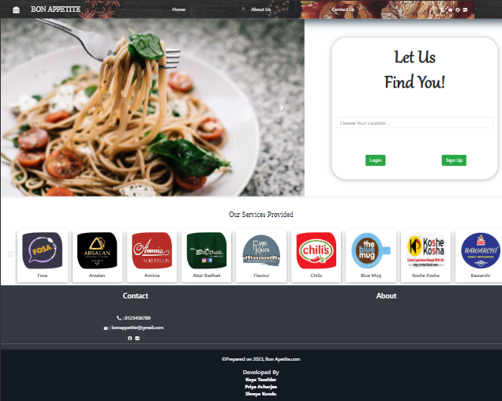
<h2>Login Page</h2>
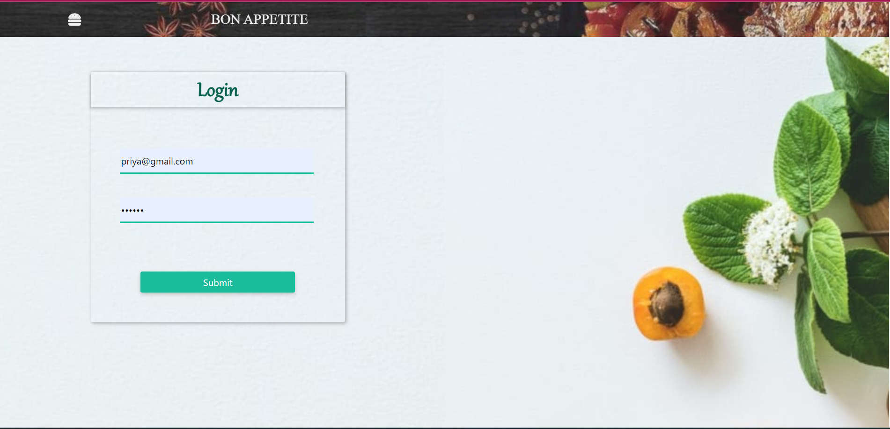
<h2>Signup Page</h2>
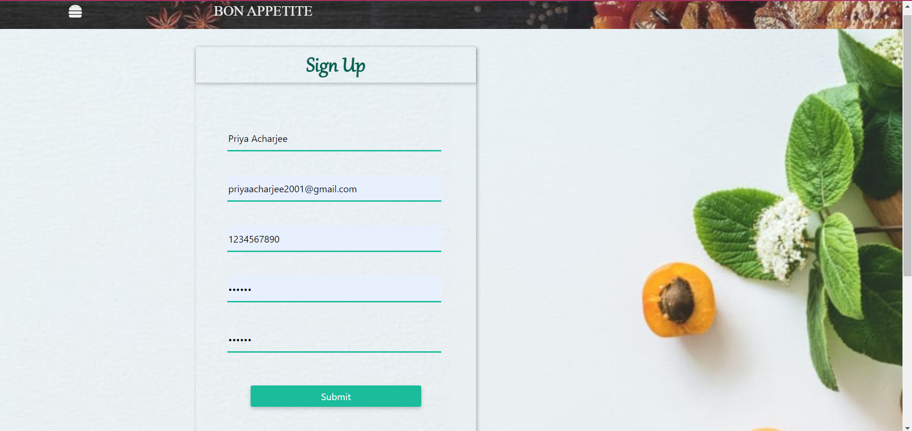
<h2>Home Page</h2>
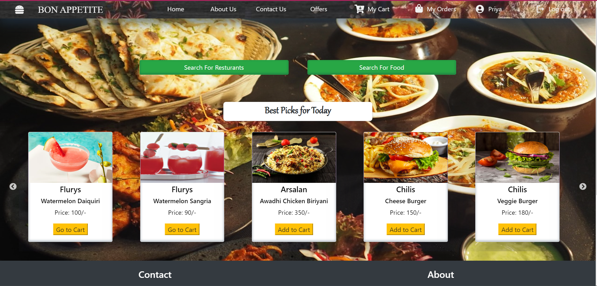
<h2>Restaurant Page</h2>
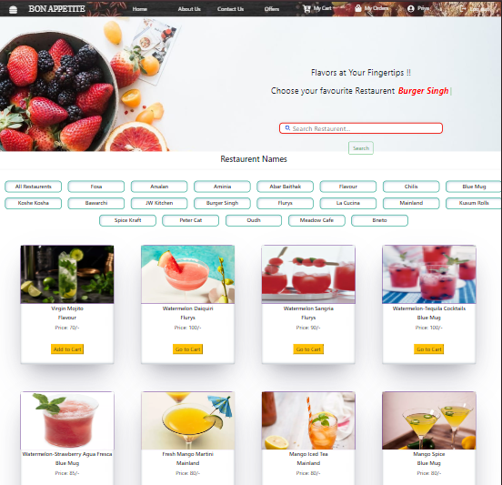
<h2>All Food Page</h2>
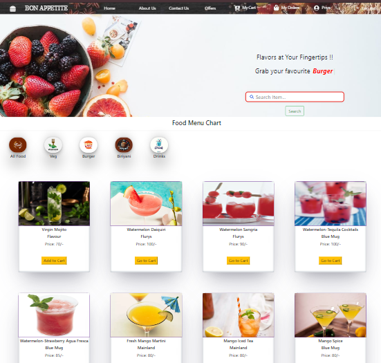
<h2>Cart Page</h2>
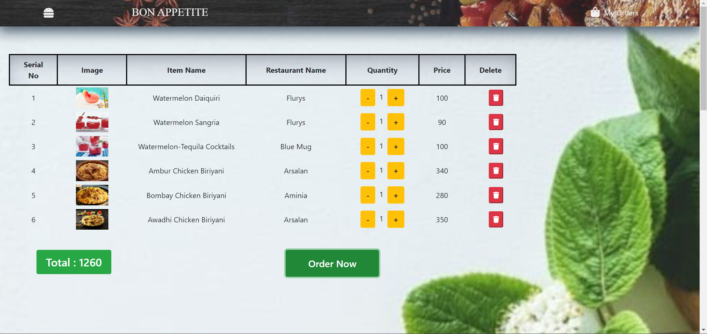
<h2>Order Page</h2>
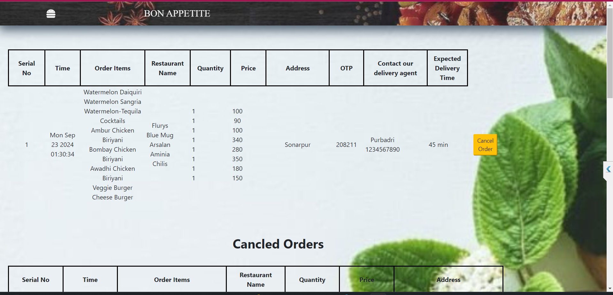 

---
### 🛠 Admin Panel

  

    

      <h3> Update Details</h3>
      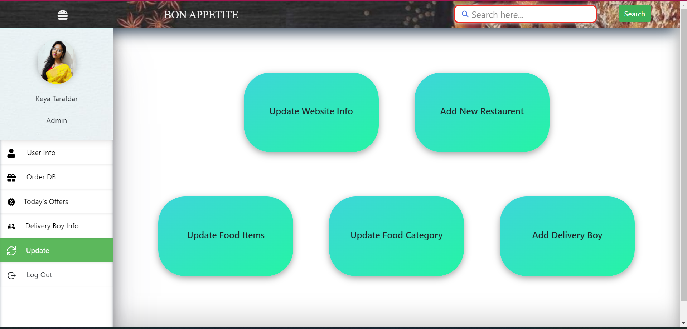
    

    

    <h3> Update Foods</h3>
      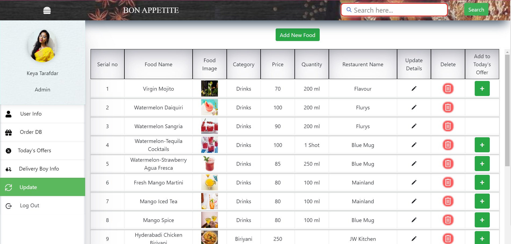
    

    

    <h3> Update Restaurents</h3>
      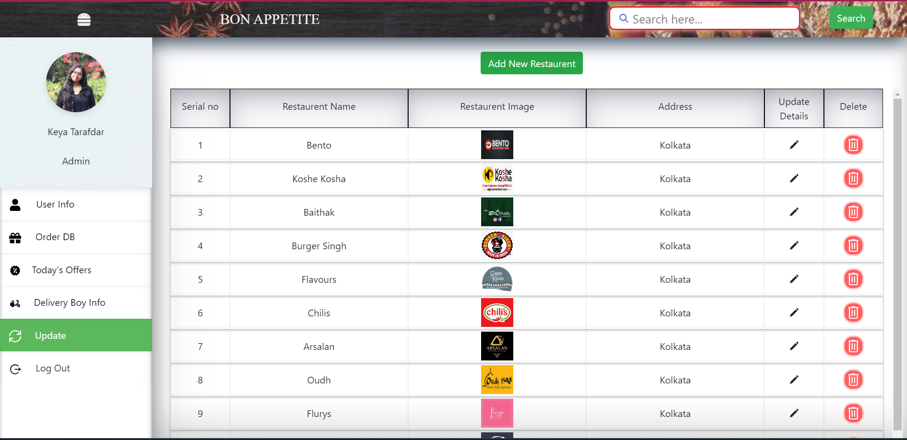
    

    

    <h3> Order DB Details</h3>
      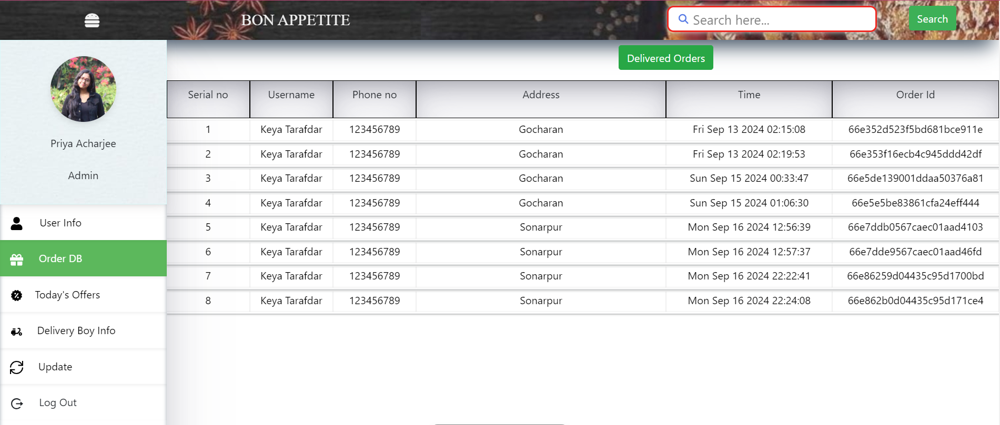
    

  

## 🚀 Features

### 🌟 User Features:
- **Login & Sign Up**: Users can create an account or log in to the website.

- **Restaurant & Food Listing**: Users can view and filter restaurants and food items based on preferences.
- **Add to Cart**: Users can add their favorite food to the cart.
- **Order Food**: Seamless checkout and order placement process.

### 🔑 Admin Features:
- **Admin Panel**: Admins can add and update:
  - Food items
  - Restaurants
  - Delivery agents
- **Manage Orders**: View and manage all orders placed on the platform.

### 🚚 Delivery Agent Features:
- **Login for Delivery Agents**: Delivery agents can log in to view their assigned orders.
- **Order Management**: Track and manage deliveries for assigned orders.

---

## 🛠️ Technologies Used

### Frontend:
- **React.js**: Dynamic user interfaces for both customers and admins.
- **CSS3**: Styled with modern CSS for a responsive and elegant design.

### Backend:
- **Node.js**: For handling server-side logic.
- **Express.js**: As a framework for Node.js to build APIs and handle routing.
- **MongoDB**: For storing user, restaurant, food, and order data.

---

